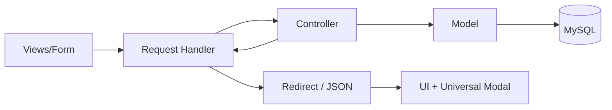

# DiscipLink V2 - Architecture README

## Tujuan Arsitektur
Dokumen ini menjelaskan struktur teknis DiscipLink V2, aliran request, komponen utama, dan area pengembangan berikutnya.

## Struktur Direktori

```text
.
├── Controllers/          # Orkestrasi business flow dari handler ke model
├── Models/               # Query database dan akses data
├── Request/              # HTTP entrypoint untuk aksi (POST/GET)
├── views/                # Halaman UI
│   └── partials/         # Komponen UI reusable (app shell)
├── js/                   # Interaksi frontend
├── css/                  # Styling
├── Database/             # Migration, seeder, SQL, CLI artisan-like
├── helpers/              # Helper global (contoh: flash modal)
└── document/             # Dokumen tambahan / aset upload
```

## Pola Arsitektur
DiscipLink V2 menggunakan pola sederhana berbasis **MVC + Request Handler**:

1. **View** mengirim form/aksi ke file di `Request/`.
2. **Request Handler** melakukan validasi awal + session flow.
3. **Controller** menjalankan logic aplikasi dan koordinasi model.
4. **Model** melakukan query ke database lewat PDO.
5. **Handler/View** mengembalikan hasil ke UI (redirect + flash modal / JSON).

## Alur Operasi (High-level)

### 1) Login
- Endpoint: `Request/Handler_Login.php`
- Controller: `Controllers/UserController.php`
- Model: `Models/Users.php`
- Output:
  - sukses: set session role + redirect role page
  - gagal: flash modal error ke `views/login.php`

### 2) Pelaporan Pelanggaran
- Endpoint: `Request/Handler_Pelaporan.php`
- Controller: `Controllers/PelanggaranController.php`
- Model: `Models/Pelanggaran.php`
- Fitur tambahan:
  - lookup mahasiswa by NIM (`action=lookup_mahasiswa`, JSON)
  - auto-resolve sanksi default berdasarkan tingkat

### 3) News Management (Admin)
- Endpoint: `Request/Handler_News.php`
- Controller: `Controllers/NewsController.php`
- Model: `Models/News.php`
- Operasi: create, update, delete berita + upload gambar

### 4) Tata Tertib Management (Admin)
- Endpoint: `Request/Handler_Tatib.php`
- Controller: `Controllers/TatibController.php`
- Model: `Models/Tatib.php`
- Operasi: create, update, delete tata tertib

### 5) Upload Berkas Pelanggaran
- Endpoint: `Request/Handler_uploads.php`
- Output: JSON (`success`, `message`)
- Validasi: ukuran, MIME type, ekstensi, status upload

## Session & Role Model
Session utama:
- `$_SESSION['username']`
- `$_SESSION['user_type']` (`mahasiswa` | `dosen` | `admin`)
- `$_SESSION['user_data']`

Role digunakan untuk:
- proteksi halaman
- redirect otomatis
- pemilihan data berdasarkan peran

## UI Composition
Komponen layout utama dipusatkan di:
- `views/partials/app-shell.php`

Komponen ini menyediakan:
- sidebar navigation by role
- header halaman
- renderer modal feedback universal (flash)

## Feedback System Universal
Sistem feedback operasi dipusatkan pada:
- Helper: `helpers/flash_modal.php`
- Renderer: `render_app_flash_modal(...)`
- Frontend API: `window.AppModal.show({ type, message })`

Tujuan:
- semua operasi menampilkan UX sukses/gagal yang konsisten
- mengurangi `alert()` ad-hoc lintas halaman

## Data Layer & Database Tooling
- Koneksi DB: `config.php`
- Migration/Seeder runner: folder `Database/cli/`
- SQL migration: `Database/migrations/`
- SQL seeder: `Database/seeders/`
- Command runner: `artisan`

## Arsitektur Flow Diagram (Ringkas)



## Catatan Pengembangan Lanjutan
- Standarisasi response contract antarmodule (array success/message).
- Centralized middleware-like auth/role guard untuk mengurangi duplikasi di views.
- Unit/integration test untuk handler kritikal (login, pelaporan, upload).
- Pemisahan service layer untuk logic yang kompleks.
