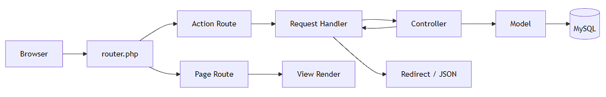

# DiscipLink V2 - Architecture & Technical Notes

Dokumen ini berisi detail teknis untuk developer.  
Dokumen ringkas untuk pengguna umum tersedia di [`README.md`](./README.md).

## Tujuan Arsitektur

- Memisahkan alur halaman, aksi, dan akses data.
- Memudahkan refactor serta kolaborasi tim.
- Menjaga keamanan request (tokenisasi ID + session hardening).
- Menstandarkan feedback UI dan alur error.

## Stack & Runtime

- PHP native (tanpa framework)
- PDO untuk koneksi database
- MySQL/MariaDB
- HTML/CSS/JavaScript (vanilla)
- CLI internal `artisan` untuk migrate/seed/serve

## Struktur Direktori

```text
.
├── controllers/          # Orkestrasi business flow
├── models/               # Query database dan akses data
├── request/              # HTTP action entrypoint
├── views/                # UI layer
│   ├── admin/
│   ├── auth/
│   ├── pelanggaran/
│   ├── public/
│   ├── tatib/
│   └── partials/
├── helpers/              # Helper routing, token, SEO, path, flash
├── database/             # Migration, seeder, CLI command kernel
│   ├── migrations/       # SQL migrasi aktif
│   ├── seeders/          # SQL seed aktif
│   └── legacy/           # Arsip SQL dump legacy (non-active)
├── js/
├── css/
├── document/             # Dokumen upload runtime
└── img/                  # Aset visual statis
```

Dokumen struktur rinci:

- `docs/structure/PROJECT-STRUCTURE.md`
- `docs/structure/FILE-INDEX.md`

## Pola Arsitektur

DiscipLink V2 menggunakan pola **MVC + Request Handler + Central Router**:

1. `router.php` menerima semua request.
2. Request dipetakan ke page route atau action route.
3. Untuk action route, file di `request/` melakukan validasi awal.
4. `Controller` mengeksekusi logic aplikasi.
5. `Model` melakukan query melalui PDO.
6. Response kembali sebagai redirect HTML atau JSON.

## Request Lifecycle



## Routing Design

Routing registry terpusat berada di `helpers/route_helper.php`.

### Page Routes

- `/`
- `/login`
- `/tatib`
- `/pelanggaran`
- `/pelanggaran/dosen`
- `/pelaporan`
- `/pelaporan/edit?id_detail=<token>`
- `/notifikasi`
- `/berita?slug=<slug>`
- `/admin`
- `/admin/tatib`
- `/admin/news`
- `/admin/news/tambah`
- `/admin/news/edit?id_news=<token>`

### Action Routes

- `/action/login`
- `/action/logout`
- `/action/pelanggaran`
- `/action/notifikasi`
- `/action/news`
- `/action/tatib`
- `/action/upload`
- `/action/download?file=<filename>`

### Backward Compatibility

Format legacy route masih didukung:

- `/p/<token>` untuk page
- `/a/<token>` untuk action

## Security Architecture

### 1) ID Tokenization

ID sensitif pada query string ditokenkan, contoh:

- `id_news`
- `id_detail`
- `id_tatib`
- `id_sanksi`

Implementasi utama:

- issue token: `app_id_token(...)`
- resolve token: `app_id_resolve(...)`
- helper: `helpers/token_helper.php`

### 2) Token Crypto & Binding

- Secret key disimpan di: `storage/keys/app_token.key`
- Algoritma:
  - Sodium `secretbox` bila tersedia
  - fallback OpenSSL `aes-256-gcm`
- Payload token mencakup:
  - token type (`route`/`id`)
  - subject entity
  - issued-at & expiry
  - nonce
  - hash session ID (`sid`) untuk binding ke sesi aktif

### 3) Session Hardening

- Idle timeout: 1800 detik (30 menit)
- Timeout diproses di router sebelum dispatch route
- Jika expired:
  - request page diarahkan ke login
  - request action mengembalikan JSON unauthorized

### 4) Access Guard

- Akses langsung ke `/views/*` dan `/request/*` diblok oleh router
- Route yang tidak valid mengembalikan error page/JSON sesuai konteks

### 5) File Security

Upload (`request/handler-upload.php`):

- validasi ukuran (maks 2 MB),
- validasi MIME,
- validasi ekstensi whitelist,
- penamaan file disanitasi.

Download (`request/handler-download.php`):

- validasi ekstensi whitelist,
- sanitasi nama file (`basename`),
- MIME detection via `finfo`,
- wajib sesi login.

## Modul Teknis Utama

### Auth

- Handler: `request/handler-login.php`
- Controller: `controllers/UserController.php`
- Model: `models/User.php`
- Output: set session + redirect by role

### Pelanggaran & Pelaporan

- Handler: `request/handler-pelanggaran.php`
- Controller: `controllers/PelanggaranController.php`
- Model: `models/Pelanggaran.php`
- Catatan:
  - lookup mahasiswa by NIM (`action=lookup_mahasiswa`)
  - update status notifikasi read/all-read

### Tata Tertib

- Handler: `request/handler-tatib.php`
- Controller: `controllers/TatibController.php`
- Model: `models/Tatib.php`, `models/Sanksi.php`

### News

- Handler: `request/handler-news.php`
- Controller: `controllers/NewsController.php`
- Model: `models/News.php`
- Catatan:
  - slug builder + canonical redirect 301 pada detail berita,
  - sanitasi HTML whitelist saat create/update,
  - rich text editor untuk admin create/edit.

### Notifikasi

- Handler: `request/handler-notifikasi.php`
- Controller: `controllers/PelanggaranController.php`
- Output: JSON untuk update status baca notifikasi

## UI Composition

Layout shell terpusat:

- `views/partials/app-shell.php`

Feedback modal terpusat:

- helper: `helpers/flash_modal.php`
- view component: `views/components/modals/app-feedback-modal.php`
- client API: `window.AppModal.show({ type, message })`

## SEO & Header Handling

Helper SEO:

- `helpers/seo_helper.php`

Fitur:

- canonical host enforcement,
- security headers,
- meta tags + Open Graph/Twitter style tags,
- JSON-LD tags,
- `robots.txt` dan `sitemap.xml`.

## Error Handling

- Error/exception handler dipasang di `router.php`
- Untuk route JSON: return struktur `{ success, message }`
- Untuk route halaman: render custom error pages (`errors/*.php`)

## Database Tooling

Command runner:

- `artisan` -> `database/cli/ConsoleKernel.php`

Command utama:

- `php artisan migrate`
- `php artisan migrate --seed`
- `php artisan migrate:fresh --seed --force`
- `php artisan db:seed`
- `php artisan serve`
- `php artisan serve --hot`

Aturan migrasi/seed:

- migration: `database/migrations/*.sql`
- seeder: `database/seeders/*.sql`
- arsip SQL lama: `database/legacy/*.sql` (tidak dieksekusi otomatis)
- file dieksekusi ter-track dan punya checksum drift detection

Referensi lengkap:

- [`database/README.md`](./database/README.md)

## Area Lanjutan (Backlog Teknis)

1. Middleware auth/role terpusat untuk mengurangi duplikasi guard di view.
2. Service layer untuk logic yang mulai kompleks (news, pelaporan, notifikasi).
3. Contract response lintas handler agar shape data konsisten.
4. Unit/integration test untuk handler kritikal (login, pelaporan, upload/download).
