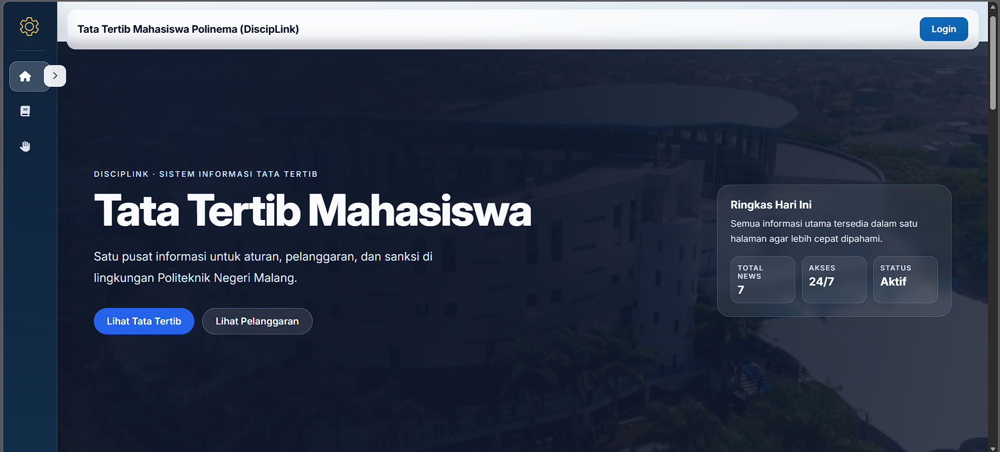
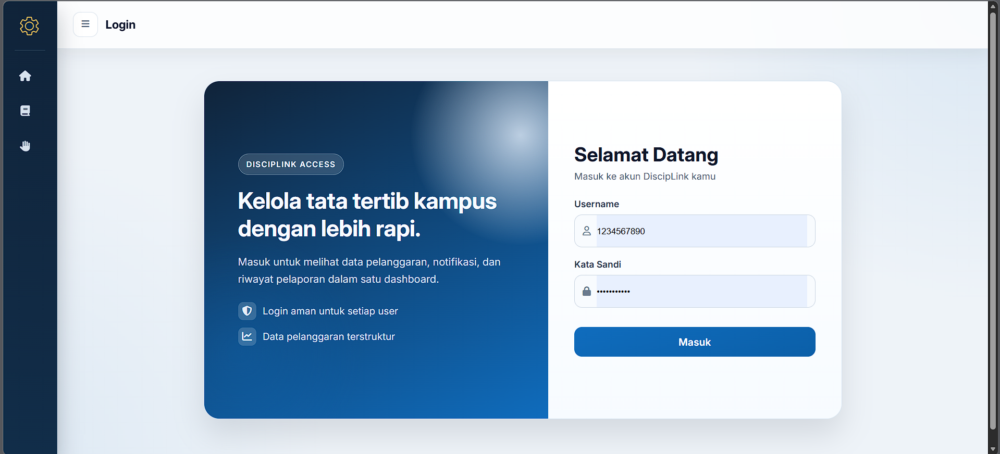
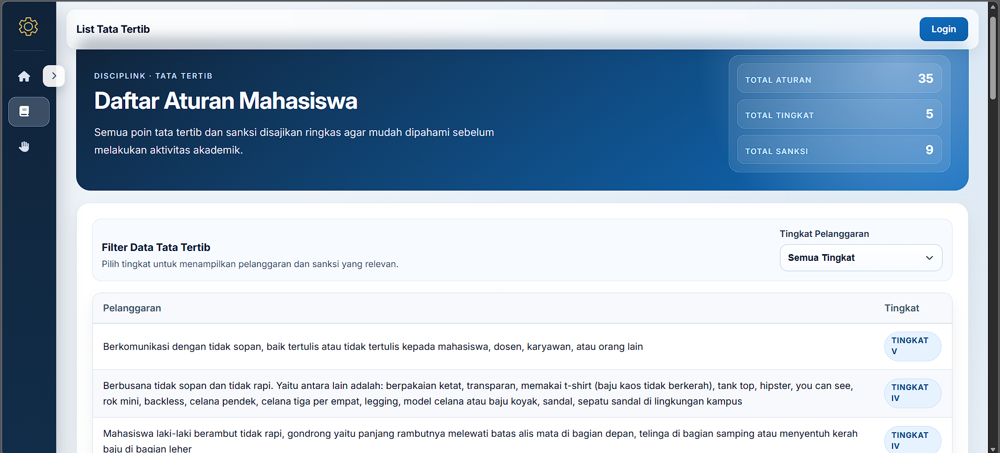
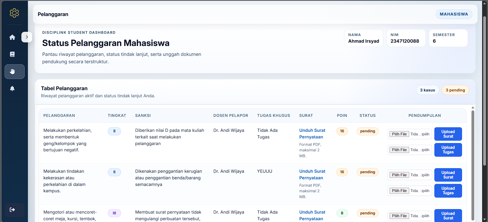
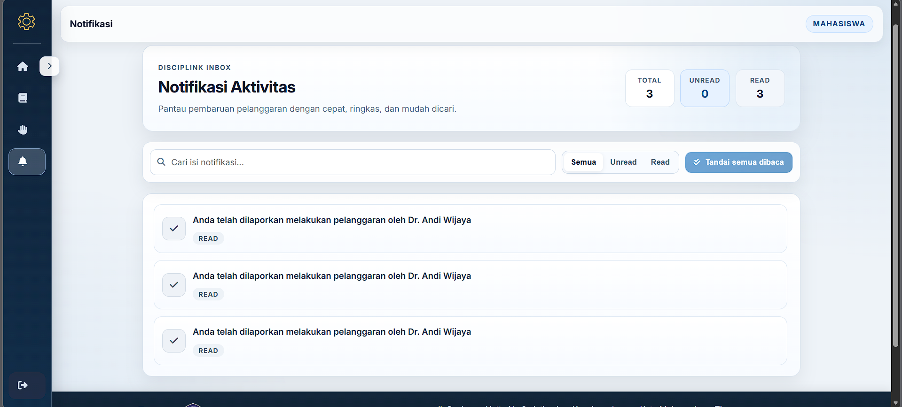
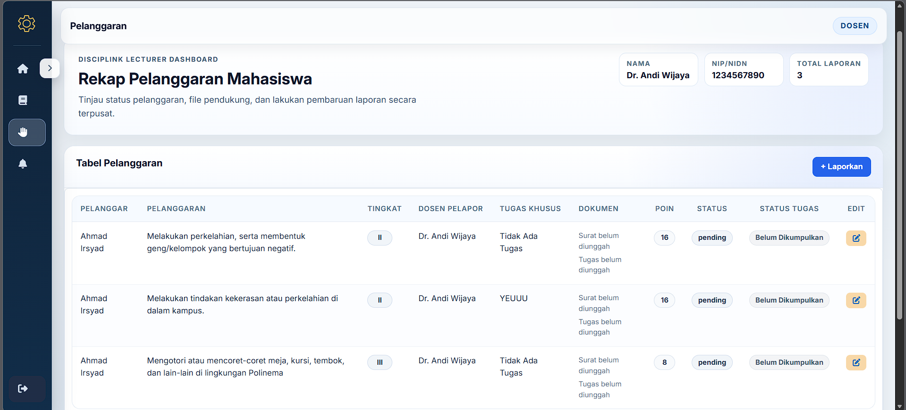
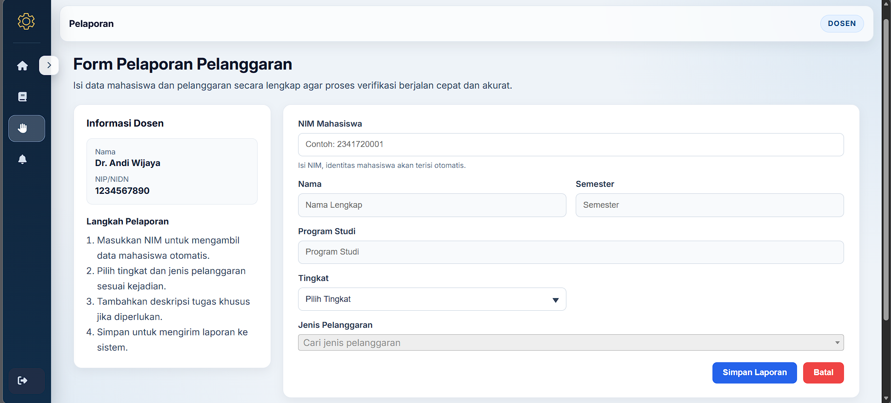
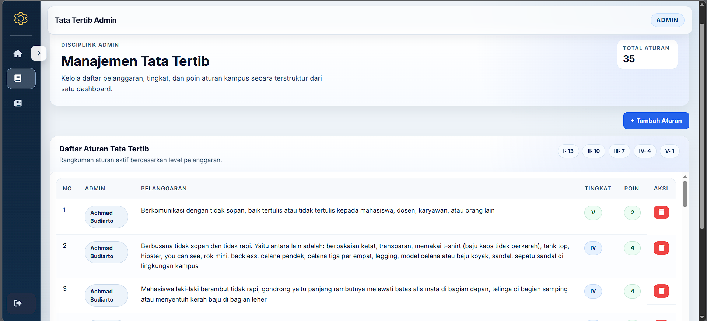
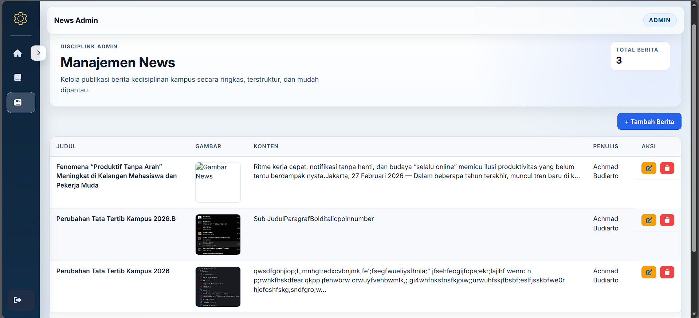
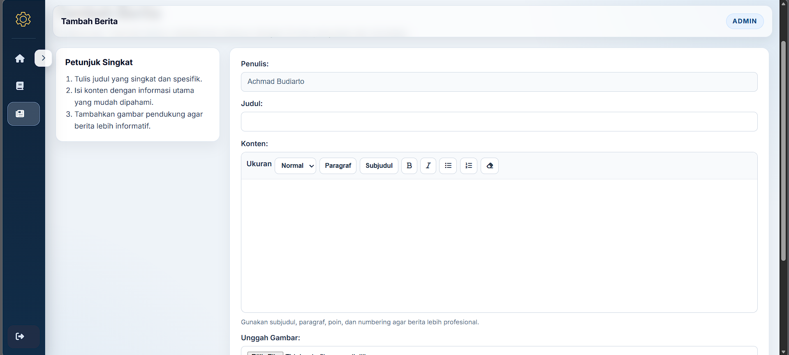

# DiscipLink V2

Sistem informasi tata tertib mahasiswa untuk membantu proses pembinaan disiplin secara lebih rapi, jelas, dan terdokumentasi.

## Apa Itu DiscipLink?

DiscipLink adalah aplikasi web yang dipakai untuk:

- melihat aturan tata tertib kampus,
- mencatat pelanggaran mahasiswa,
- memantau status tindak lanjut,
- mengelola notifikasi,
- mengelola berita informasi kedisiplinan.

Aplikasi ini digunakan oleh 3 jenis pengguna:

1. `Mahasiswa`
2. `Dosen`
3. `Admin`

## Manfaat Utama

- Informasi aturan dan sanksi jadi lebih mudah diakses.
- Proses pelaporan pelanggaran lebih cepat dan terstruktur.
- Status kasus bisa dipantau langsung oleh pihak terkait.
- Berita/pengumuman kedisiplinan bisa dikelola dari satu tempat.

## Fitur Berdasarkan Pengguna

| Pengguna | Fitur Utama |
| --- | --- |
| Mahasiswa | Melihat status pelanggaran, poin, notifikasi, serta upload dokumen yang diminta. |
| Dosen | Membuat pelaporan pelanggaran dan memantau rekap laporan mahasiswa. |
| Admin | Mengelola tata tertib, mengelola berita, dan memelihara konten informasi. |

## Cara Menjalankan Aplikasi (Singkat)

Jika kamu ingin menjalankan aplikasi ini di komputer lokal:

1. Clone repository lalu masuk ke folder proyek.

```bash
git clone <url-repository-anda>
cd TataTertibMhsV2
```

1. Buat file `.env` dari contoh.

```bash
cp .env.example .env
```

1. Sesuaikan koneksi database di file `.env`.

```dotenv
DB_DSN="mysql:host=127.0.0.1;port=3306;dbname=DiscipLink;charset=utf8mb4"
DB_USER="root"
DB_PASS=""
```

1. Jalankan migrasi dan isi data contoh.

```bash
php artisan migrate:fresh --seed --force
```

1. Jalankan server lokal.

```bash
php artisan serve --host=127.0.0.1 --port=8000
```

1. Buka aplikasi di browser:
   <http://127.0.0.1:8000>

## Troubleshooting Cepat (500/404 Saat Deploy)

Saat error di server (mis. cPanel), cek dulu checklist ini:

1. File konfigurasi tersedia:
   - `config.php` ada di root project.
   - `.env` ada dan berisi `DB_DSN`, `DB_USER`, `DB_PASS` yang valid.
2. File key token tersedia dan permission benar:
   - `storage/keys/app_token.key` harus bisa dibaca/ditulis oleh PHP.
   - Jika belum ada, pastikan folder `storage/keys` writable agar key bisa dibuat otomatis.
3. Folder runtime tersedia:
   - `storage/uploads/` dan `storage/uploads/news/` ada.
   - Permission folder upload mengizinkan proses `move_uploaded_file`.
4. Aturan rewrite aktif:
   - `.htaccess` di lokasi deploy (`public_html` dan/atau `public_html/DisciplinkV2`) sesuai skenario URL.
   - `mod_rewrite` aktif.
5. Jika masih gagal, cek log web server/PHP lebih dulu sebelum ubah kode.

## Akun Contoh (Data Seeder)

| Role | Username | Password |
| --- | --- | --- |
| Mahasiswa | `2341238901` | `password123` |
| Dosen | `1234567890` | `password123` |
| Admin | `ADMIN001` | `admin123` |

## Struktur Folder (Ringkas)

```text
.
├── controllers/              # Orkestrasi use-case
├── models/                   # Query dan akses data
├── request/                  # Handler action HTTP
├── views/                    # Template UI (public/admin/auth/components)
├── helpers/                  # Utilitas route/path/token/SEO/error
├── database/
│   ├── migrations/           # SQL migrasi aktif
│   ├── seeders/              # SQL seeder aktif
│   └── legacy/               # Arsip SQL lama (non-active)
├── css/ js/ img/             # Aset frontend
├── document/                 # Dokumen upload runtime
├── storage/                  # Penyimpanan private runtime
└── docs/structure/           # Dokumen struktur proyek + file index
```

Detail lengkap:

- [`docs/structure/PROJECT-STRUCTURE.md`](./docs/structure/PROJECT-STRUCTURE.md)
- [`docs/structure/FILE-INDEX.md`](./docs/structure/FILE-INDEX.md)

## App Gallery

### Public / Umum

| Halaman | Preview | Deskripsi |
| --- | --- | --- |
| Homepage |  | Landing page DiscipLink untuk pengguna umum. |
| Login |  | Halaman autentikasi multi-role. |
| List Tata Tertib |  | Halaman daftar aturan tata tertib yang dapat diakses umum. |

### Mahasiswa

| Halaman | Preview | Deskripsi |
| --- | --- | --- |
| Dashboard Pelanggaran Mahasiswa |  | Monitoring riwayat pelanggaran, poin, status, dan upload berkas. |
| Notifikasi Mahasiswa |  | Inbox notifikasi aktivitas dan update status pelanggaran. |

### Dosen

| Halaman | Preview | Deskripsi |
| --- | --- | --- |
| Rekap Pelanggaran Dosen |  | Tabel rekap pelanggaran mahasiswa untuk ditinjau dosen. |
| Form Pelaporan Dosen |  | Form pelaporan pelanggaran baru oleh dosen. |

### Admin

| Halaman | Preview | Deskripsi |
| --- | --- | --- |
| Manajemen Tata Tertib |  | CRUD data aturan, tingkat, dan poin pelanggaran. |
| Manajemen News (List/CRUD) |  | Daftar berita admin dengan aksi edit dan hapus. |
| Tambah Berita (Rich Editor) |  | Form tambah berita dengan editor konten terformat. |

### Branding & Asset Logo

| Aset | Preview | Keterangan |
| --- | --- | --- |
| Logo penuh DiscipLink + slogan |  | Logo utama DiscipLink (versi lengkap). |
| Logo icon DiscipLink |  | Ikon turunan dari logo DiscipLink. |
| Hero background |  | Latar hero halaman public (gedung Graha Polinema). |
| App icon set (Polinema) |  | `apple-touch-icon.png`, `favicon.ico`, `favicon.svg`, `favicon-96x96.png`, `web-app-manifest-192x192.png`, dan `web-app-manifest-512x512.png` menggunakan logo Polinema. |

## Dokumentasi Lanjutan

Untuk pembaca non-teknis, README ini sudah cukup jelas.

Jika Anda developer dan butuh detail teknis, buka:

- Arsitektur teknis: [`README-ARCHITECTURE.md`](./README-ARCHITECTURE.md)
- Database tooling: [`database/README.md`](./database/README.md)
- Struktur folder detail: [`docs/structure/PROJECT-STRUCTURE.md`](./docs/structure/PROJECT-STRUCTURE.md)
- Indeks file sederhana: [`docs/structure/FILE-INDEX.md`](./docs/structure/FILE-INDEX.md)
- Referensi UI/UX: <https://www.figma.com/design/yRxgSGu5uvuoKQznRxPCNg/UI%2FUX-Sistem-Tatib?node-id=10-572&node-type=frame&t=FUBlBYXBfDiK1yST-0>

## Sumber Proyek

Refactor dari proyek awal:
<https://github.com/VarizkyNaldiba/TataTertibMhs>

## Lisensi

MIT License
