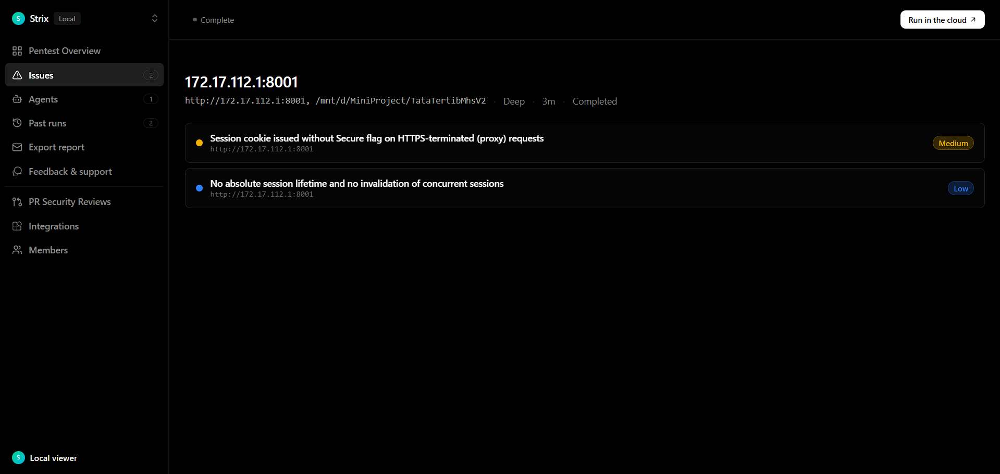

# Area 2 - After fix (verification evidence)

Bukti bahwa dua temuan pada run SESSION & CSRF **sudah diperbaiki dan terbukti tertutup**.

| | |
| --- | --- |
| **Findings** | `vuln-0001` CWE-614 MEDIUM - `vuln-0002` CWE-613 LOW |
| **Fix commits** | `20bef78` (helper) - `9f55f2a` (CWE-614 + 613a) - `f1503bb` (migrasi) - `484bb67` (CWE-613b + fix regresi) |
| **Regression test** | `tests/security/SessionLifecycleSuite.php` (6 test) |
| **Reproduce script** | [`reproduce.sh`](reproduce.sh) - output: [`reproduce-after.log`](reproduce-after.log) |

---

## Before vs After

`before/` = artefak Strix asli (kondisi rentan). `after/` = hasil reproduksi ulang setelah perbaikan.

| # | Skenario | BEFORE (rentan) | AFTER (terbukti aman) |
| --- | --- | --- | --- |
| 1 | `GET /login` dengan `X-Forwarded-Proto: https` | HSTS ada, cookie **tanpa** `Secure` - | Cookie **`Secure`** - (dan HSTS) |
| 2 | `GET /login` plain HTTP localhost | tanpa `Secure` | tanpa `Secure` - (tetap bisa login lab) |
| 3 | Login ke-2 akun yang sama | kedua sesi hidup (200 & 200) - | sesi pertama **302 (dicabut)**, kedua 200 - |
| 4 | Sesi idle 30 menit | kedaluwarsa | tetap kedaluwarsa - (tidak berubah) |
| 5 | Sesi berumur >12 jam (absolut) | **tetap hidup** - | **ditolak** - |

Angka BEFORE diambil dari `before/vulnerabilities/vuln-0001.md` & `vuln-0002.md`. Angka AFTER dihasilkan skrip di folder ini.

---

### Screenshot (evidence)

 - bukti dua temuan AREA 2: cookie session tanpa flag `Secure` (proxy HTTPS) dan tidak ada absolute lifetime / tidak ada invalidasi sesi bersamaan.

---

## Cara reproduksi (after)

```bash
# Area 2 - After fix (verification evidence)
php artisan serve --host=0.0.0.0 --port=8123

# Area 2 - After fix (verification evidence)
bash reproduce.sh http://127.0.0.1:8123       # harapan: "RESULT: 6 passed, 0 failed"

# Area 2 - After fix (verification evidence)
bash reproduce.sh http://127.0.0.1:8123 > reproduce-after.log 2>&1
```

> **Catatan:** skrip menghapus baris `USER_SESSION` + audit `login_fail` untuk akun uji
> (agar deterministik). **Jalankan hanya di lab/DB sekali-pakai, bukan produksi.**

---

## Status verifikasi
- **Cookie Secure mengikuti sinyal proxy** (skenario 1) tapi **plain HTTP tidak dipaksa Secure** (2)
 - celah CWE-614 tertutup tanpa merusak login http lokal.
- **Login kedua mencabut sesi pertama** (3); login normal tetap jalan; idle tetap (4); dan ada
  batas umur absolut 12 jam (5) - CWE-613 tertutup.
- **Regression test otomatis** (`SessionLifecycleSuite`, 6/6) mengunci perilaku ini; suite penuh 182/182.

Perbaikan kode:

- `helpers/path_helper.php` - `app_request_is_https()` (satu sumber kebenaran skema HTTPS; dipakai cookie + HSTS).
- `helpers/token_helper.php` - cookie `Secure` dari helper itu; `__created_at` + `APP_SESSION_ABSOLUTE_TTL`
  (12 jam); guard pencabutan sesi di `app_session_touch_or_expire`.
- `helpers/session_inventory_helper.php` (baru) + tabel `USER_SESSION` - daftar sesi hidup per akun;
  login mendaftarkan + mencabut yang lain, logout menghapus.
- `router.php` - memuat `config.php` **sebelum** cek sesi (guard butuh `$GLOBALS['connect']`; tanpa itu
  guard fail-soft dan jadi no-op - akar regresi yang ditemukan saat verifikasi).
