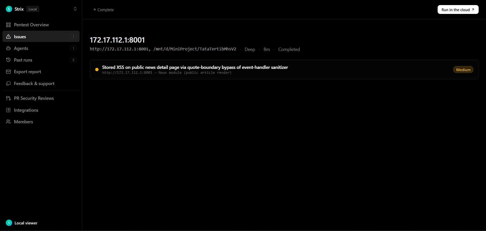

# Area 5 - After fix (verification evidence)

Bukti bahwa temuan AREA 5 (stored XSS pada halaman berita) **sudah diperbaiki dan terbukti tertutup**.

| | |
|---|---|
| **Finding** | `vuln-0001` CWE-79 MEDIUM (CVSS 5.4) |
| **Fix commit** | `7b4c39d` |
| **Regression test** | `tests/unit/Area5XssSuite.php` (5 test) |
| **Reproduce** | [`reproduce.sh`](reproduce.sh) - output: [`reproduce-after.log`](reproduce-after.log) |

---

## Before vs After

`before/` = artefak Strix asli (kondisi rentan). `after/` = hasil reproduksi ulang setelah perbaikan.

| Payload | BEFORE (rentan) | AFTER (terbukti aman) |
|---|---|---|
| `<div title="x"onmouseover="alert(1)">t</div>` | handler **lolos** tersimpan & di-render - | handler **dibuang** - `<div title="x">t</div>` - |
| `<p title="a"onfocus="alert(2)" autofocus>t</p>` | autofocus/onfocus lolos - | `onfocus` dibuang - |
| `<a href="javascript:alert(1)">x</a>` | URI lolos - | URI dibuang - `x` - |
| `<script>alert(1)</script>` | tag dibuang, isi tersisa | blok **script dibuang seluruhnya** - |
| `<p>Halo <strong>dunia</strong></p>` | utuh | utuh - (tidak rusak) |

Angka BEFORE diambil dari `before/vulnerabilities/vuln-0001.md` (bukti run Strix, termasuk eksekusi browser headless). Angka AFTER dihasilkan skrip di folder ini.

---

### Screenshot (evidence)

 - bukti temuan AREA 5: payload `<div title="x"onmouseover="alert(...)">` yang dulu lolos sanitizer (kini event handler dibuang).

---

## Cara reproduksi (after)

```bash
# Area 5 - After fix (verification evidence)
REPRO_ROOT=/path/ke/repo bash reproduce.sh     # harapan: "RESULT: 5 passed, 0 failed"
```

Skenario: kirim tiap payload ke `NewsController::sanitizeNewsContent()` dan pastikan tidak ada
`onmouseover`/`onfocus`/`javascript:`/`<script>` yang tersisa, sedangkan markup yang diizinkan tetap.

---

## Status verifikasi
- **Semua vektor XSS dibuang** (quote-boundary, autofocus, javascript:, script-block) sedangkan
  konten sah (`<strong>`) **tetap** - celah CWE-79 tertutup tanpa merusak fitur.
- **Regression test** (`Area5XssSuite`, 5/5) mengunci perilaku ini; suite penuh 191/191
  (termasuk `HttpMatrixSuite` stored-XSS test - tidak rusak).

Perbaikan kode (store `controllers/NewsController.php` **dan** render `views/public/berita-detail.php`):
- Buang blok `<script>`/`<style>` **beserta isinya** sebelum `strip_tags`.
- Regex event-handler diubah dari `[\s\/]on[a-z]+` (butuh spasi/`/` di depan) menjadi `\bon[a-z]+`
  (batas kata) - menangkap `<div title="x"onmouseover=...>`.
- Buang URI `javascript:`/`vbscript:`/`data:` pada `href`/`src`.

**Catatan jujur:** laporan Strix merekomendasikan mengganti sanitizer buatan sendiri dengan pustaka
teruji (mis. HTML Purifier). Perbaikan ini menutup vektor yang terbukti, tetapi sanitizer berbasis
regex tetap lebih rapuh daripada pustaka khusus - dicatat sebagai follow-up jangka menengah.
